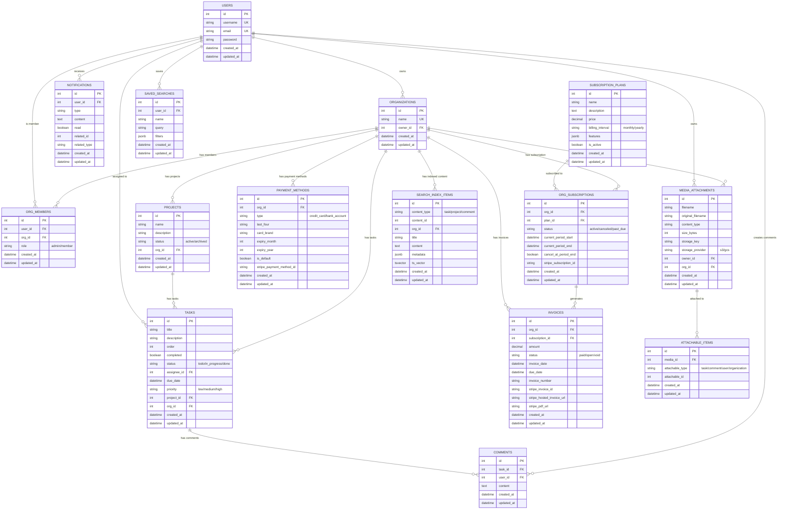

# Database Structure Diagram

```mermaid
erDiagram
    %% Core Entities (Currently Implemented)
    USERS {
        int id PK
        string username UK
        string email UK
        string password
        datetime created_at
        datetime updated_at
    }

    ORGANIZATIONS {
        int id PK
        string name UK
        int owner_id FK
        datetime created_at
        datetime updated_at
    }

    ORG_MEMBERS {
        int id PK
        int user_id FK
        int org_id FK
        string role "admin/member"
        datetime created_at
        datetime updated_at
    }

    %% Proposed Extensions

    %% Projects (Extended with additional fields)
    PROJECTS {
        int id PK
        string name
        string description
        string status "active/archived"
        int org_id FK
        datetime created_at
        datetime updated_at
    }

    %% Tasks (Renamed and Extended from TODOS)
    TASKS {
        int id PK
        string title
        string description
        int order
        boolean completed
        string status "todo/in_progress/done"
        int assignee_id FK
        datetime due_date
        string priority "low/medium/high"
        int project_id FK
        int org_id FK
        datetime created_at
        datetime updated_at
    }

    %% Collaboration
    COMMENTS {
        int id PK
        int task_id FK
        int user_id FK
        text content
        datetime created_at
        datetime updated_at
    }

    NOTIFICATIONS {
        int id PK
        int user_id FK
        string type
        text content
        boolean read
        int related_id
        string related_type
        datetime created_at
        datetime updated_at
    }

    %% Billing and Subscriptions
    SUBSCRIPTION_PLANS {
        int id PK
        string name
        text description
        decimal price
        string billing_interval "monthly/yearly"
        jsonb features
        boolean is_active
        datetime created_at
        datetime updated_at
    }

    ORG_SUBSCRIPTIONS {
        int id PK
        int org_id FK
        int plan_id FK
        string status "active/canceled/past_due"
        datetime current_period_start
        datetime current_period_end
        boolean cancel_at_period_end
        string stripe_subscription_id
        datetime created_at
        datetime updated_at
    }

    PAYMENT_METHODS {
        int id PK
        int org_id FK
        string type "credit_card/bank_account"
        string last_four
        string card_brand
        int expiry_month
        int expiry_year
        boolean is_default
        string stripe_payment_method_id
        datetime created_at
        datetime updated_at
    }

    INVOICES {
        int id PK
        int org_id FK
        int subscription_id FK
        decimal amount
        string status "paid/open/void"
        datetime invoice_date
        datetime due_date
        string invoice_number
        string stripe_invoice_id
        string stripe_hosted_invoice_url
        string stripe_pdf_url
        datetime created_at
        datetime updated_at
    }

    %% Media and Attachments
    MEDIA_ATTACHMENTS {
        int id PK
        string filename
        string original_filename
        string content_type
        int size_bytes
        string storage_key
        string storage_provider "s3/gcs"
        int owner_id FK
        int org_id FK
        datetime created_at
        datetime updated_at
    }

    ATTACHABLE_ITEMS {
        int id PK
        int media_id FK
        string attachable_type "task/comment/user/organization"
        int attachable_id
        datetime created_at
        datetime updated_at
    }

    %% Search
    SAVED_SEARCHES {
        int id PK
        int user_id FK
        string name
        string query
        jsonb filters
        datetime created_at
        datetime updated_at
    }

    SEARCH_INDEX_ITEMS {
        int id PK
        string content_type "task/project/comment"
        int content_id
        int org_id FK
        string title
        text content
        jsonb metadata
        tsvector ts_vector
        datetime created_at
        datetime updated_at
    }

    %% Relationships

    %% Core Relationships (Currently Implemented)
    USERS ||--o{ ORGANIZATIONS : "owns"
    USERS ||--o{ ORG_MEMBERS : "is member"
    ORGANIZATIONS ||--o{ ORG_MEMBERS : "has members"
    ORGANIZATIONS ||--o{ PROJECTS : "has projects"

    %% Extended Relationships
    USERS ||--o{ TASKS : "assigned to"
    PROJECTS ||--o{ TASKS : "has tasks"
    ORGANIZATIONS ||--o{ TASKS : "has tasks"

    %% Collaboration Relationships
    TASKS ||--o{ COMMENTS : "has comments"
    USERS ||--o{ COMMENTS : "creates comments"
    USERS ||--o{ NOTIFICATIONS : "receives"

    %% Billing and Subscription Relationships
    SUBSCRIPTION_PLANS ||--o{ ORG_SUBSCRIPTIONS : "subscribed to"
    ORGANIZATIONS ||--o{ ORG_SUBSCRIPTIONS : "has subscription"
    ORGANIZATIONS ||--o{ PAYMENT_METHODS : "has payment methods"
    ORGANIZATIONS ||--o{ INVOICES : "has invoices"
    ORG_SUBSCRIPTIONS ||--o{ INVOICES : "generates"

    %% Media and Attachment Relationships
    USERS ||--o{ MEDIA_ATTACHMENTS : "owns"
    ORGANIZATIONS ||--o{ MEDIA_ATTACHMENTS : "has"
    MEDIA_ATTACHMENTS ||--o{ ATTACHABLE_ITEMS : "attached to"

    %% Search Relationships
    USERS ||--o{ SAVED_SEARCHES : "saves"
    ORGANIZATIONS ||--o{ SEARCH_INDEX_ITEMS : "has indexed content"
```
