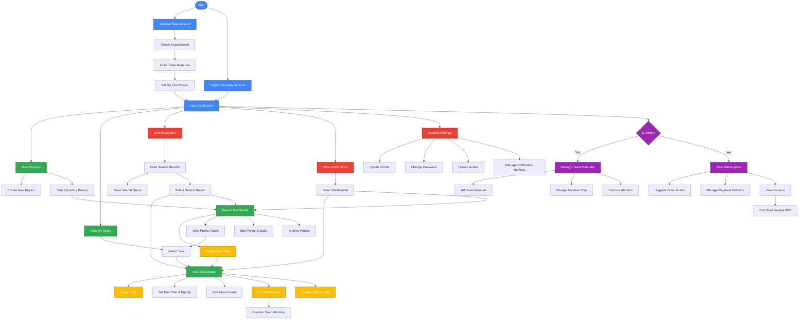
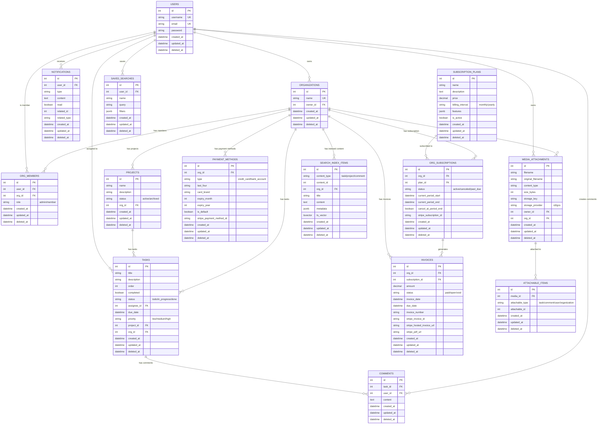

# Task Management Application Technical Design

| Author      | Yun Wang                |
| ----------- | ----------------------- |
| Status      | Draft                   |
| Date        | 2025-04-12              |

# Executive Summary

This document outlines the technical design for a multi-tenant SaaS task management application. It covers the current architecture, planned features, and implementation strategy. The application will provide project and task management capabilities with real-time collaboration, media attachments, search functionality, and tiered subscription plans.

Key components include:

- Express/TypeScript backend with PostgreSQL database
- JWT-based authentication with role-based access control
- Real-time collaboration using WebSockets and Redis
- Cloud-based media storage with S3/GCS
- Full-text search capabilities
- Stripe integration for subscription management

The document serves as a roadmap for development, outlining both immediate implementation priorities and future considerations for scaling and enhancement.

# Part 1: Decisions Made So Far

## 1.1 Core Architecture Decisions

- **Backend Stack**: Express + TypeScript
    - Chosen for team familiarity and type safety
    - Proven scalability for similar applications
    - Strong ecosystem and community support
- **Database**: PostgreSQL
    - Selected for relational data requirements
    - Strong ACID compliance for business data
    - JSON support for flexible schema needs
- **Authentication/Authorization**
    - JWT-based authentication implemented
    - Role-based access control (RBAC)
    - Organization-level permissions structure

## 1.2 Implemented Data Models

> Note: All tables include standard fields: `id` (PRIMARY KEY), `created_at`, and `updated_at`
>

```sql
-- Core entities implemented so far
organizations {
  name: string
  owner_id: integer REFERENCES users(id)
}

users {
  email: string UNIQUE
  username: string
  password: string (hashed)
}

org_members {
  org_id: integer REFERENCES organizations(id)
  user_id: integer REFERENCES users(id)
  role: string ['admin', 'member']
}

projects {
  name: string
  org_id: integer REFERENCES organizations(id)
}

todos {
  project_id: integer REFERENCES projects(id)
  title: string
  order: integer
  completed: boolean
  org_id: integer REFERENCES organizations(id)
}

```

# Part 2: API Reference

## 2.1 Authentication & User Management

```tsx
// User Authentication
POST   /register                    // Register a new user
POST   /login                       // Login a user
GET    /users/self                  // Get current user info
PATCH  /users                       // Update user info
POST   /users/avatar                // Upload or update user avatar
DELETE /users/avatar                // Remove user avatar

```

## 2.2 Organizations & Members

```tsx
// Organizations
GET    /orgs                        // Get all organizations for current user
GET    /orgs/:org_id                // Get a specific organization
POST   /orgs                        // Create a new organization
PATCH  /orgs/:org_id                // Update an organization
DELETE /orgs/:org_id                // Delete an organization
POST   /orgs/:org_id/avatar         // Upload or update organization avatar
DELETE /orgs/:org_id/avatar         // Remove organization avatar

// Organization Members
GET    /orgs/:org_id/members        // Get all members of an organization
GET    /orgs/:org_id/members/:id    // Get a specific member of an organization
POST   /orgs/:org_id/members        // Add a member to an organization
PATCH  /orgs/:org_id/members/:id    // Update a member's role in an organization
DELETE /orgs/:org_id/members/:id    // Remove a member from an organization

```

## 2.3 Projects & Tasks

```tsx
// Projects
GET    /projects                    // Get all projects for current user
GET    /projects/:project_id        // Get a specific project
POST   /projects                    // Create a new project
PATCH  /projects/:project_id        // Update a project
DELETE /projects                    // Delete all projects
DELETE /projects/:project_id        // Delete a specific project

// Tasks (Todos)
GET    /projects/:project_id/todos         // Get all todos for a project
GET    /projects/:project_id/todos/:id     // Get a specific todo
POST   /projects/:project_id/todos         // Create a new todo
PATCH  /projects/:project_id/todos/:id     // Update a todo
PATCH  /projects/:project_id/todos/:id/assign    // Assign a task to a user
PATCH  /projects/:project_id/todos/:id/status    // Update task status
PATCH  /projects/:project_id/todos/:id/priority  // Update task priority
GET    /todos/assigned                           // Get all tasks assigned to current user
DELETE /projects/:project_id/todos         // Delete all todos for a project
DELETE /projects/:project_id/todos/:id     // Delete a specific todo

```

## 2.4 Collaboration

```tsx
// Comments
POST   /projects/:project_id/todos/:id/comments  // Add a comment to a task
GET    /projects/:project_id/todos/:id/comments  // Get all comments for a task
DELETE /comments/:id                             // Delete a comment

// Notifications
GET    /notifications                            // Get all notifications for current user
PATCH  /notifications/:id                        // Mark a notification as read
DELETE /notifications                            // Delete all notifications

```

## 2.5 Media & Attachments

```tsx
// Media Attachments
POST   /media                                   // Upload a new media file
GET    /media/:id                               // Get media metadata
GET    /media/:id/content                       // Get signed URL for media content
DELETE /media/:id                               // Delete a media attachment

// Task Attachments
POST   /projects/:project_id/todos/:id/attachments                 // Attach media to a task
GET    /projects/:project_id/todos/:id/attachments                 // Get all attachments for a task
DELETE /projects/:project_id/todos/:id/attachments/:attachment_id  // Remove attachment from task

// Comment Attachments
POST   /comments/:id/attachments                // Attach media to a comment
GET    /comments/:id/attachments                // Get all attachments for a comment
DELETE /comments/:id/attachments/:attachment_id // Remove attachment from comment

```

## 2.6 Search

```tsx
// Search
GET    /search                                  // Search across all content types
GET    /search/tasks                            // Search only tasks
GET    /search/projects                         // Search only projects
GET    /search/comments                         // Search only comments
POST   /search/saved                            // Save a search query
GET    /search/saved                            // Get all saved searches
DELETE /search/saved/:id                        // Delete a saved search

```

## 2.7 Billing & Subscriptions

```tsx
// Subscription Plans
GET    /subscription_plans                       // Get all available subscription plans
GET    /subscription_plans/:id                   // Get details of a specific plan

// Organization Subscriptions
GET    /orgs/:org_id/subscription               // Get current subscription for an organization
POST   /orgs/:org_id/subscription               // Create or update subscription for an organization
PATCH  /orgs/:org_id/subscription/cancel        // Cancel subscription at period end
PATCH  /orgs/:org_id/subscription/reactivate    // Reactivate a canceled subscription

// Payment Methods
GET    /orgs/:org_id/payment_methods             // Get all payment methods for an organization
POST   /orgs/:org_id/payment_methods             // Add a new payment method (Stripe token only, no direct CC data)
PATCH  /orgs/:org_id/payment_methods/:id/default // Set a payment method as default
DELETE /orgs/:org_id/payment_methods/:id         // Remove a payment method

// Invoices
GET    /orgs/:org_id/invoices                   // Get all invoices for an organization
GET    /orgs/:org_id/invoices/:id               // Get a specific invoice
GET    /orgs/:org_id/invoices/:id/pdf           // Download invoice as PDF

```

# Part 3: User Stories

## 3.1 User Personas

- **Organization Administrator**: A user who creates and manages an organization, with full control over projects, members, and settings.
- **Team Member**: A user who belongs to one or more organizations and contributes to projects by creating and managing tasks.
- **Guest User**: A user who has limited access to view specific projects or tasks they've been invited to.

## 3.2 Core User Stories

**Authentication & User Management**

- **As a user**, I want to register for an account so that I can access the system
- **As a user**, I want to log in to my account so that I can access my organizations and projects
- **As a user**, I want to update my profile information so that my details are current
- **As a user**, I want to reset my password if I forget it so that I can regain access to my account

**Organization Management**

- **As an organization administrator**, I want to create a new organization so that I can manage projects for my team
- **As an organization administrator**, I want to invite users to my organization so that they can collaborate on projects
- **As an organization administrator**, I want to assign roles to members so that they have appropriate permissions
- **As an organization administrator**, I want to remove members from my organization when they no longer need access
- **As a user**, I want to see all organizations I belong to so that I can navigate between them

**Project Management**

- **As an organization member**, I want to create projects so that I can organize related tasks
- **As an organization member**, I want to view all projects I have access to so that I can find my work
- **As an organization member**, I want to update project details so that information stays current
- **As an organization administrator**, I want to archive or delete projects that are no longer needed

**Task Management**

- **As a team member**, I want to create tasks within a project so that work can be tracked
- **As a team member**, I want to assign tasks to myself or others so that responsibilities are clear
- **As a team member**, I want to update task status (todo, in progress, done) so that progress is visible
- **As a team member**, I want to set priorities on tasks so that important work is highlighted
- **As a team member**, I want to set due dates on tasks so that deadlines are clear
- **As a team member**, I want to mark tasks as complete when finished
- **As a team member**, I want to view all tasks assigned to me across projects so I can manage my workload

**Collaboration**

- **As a team member**, I want to comment on tasks so that I can provide updates or ask questions
- **As a team member**, I want to @mention other users in comments so they are notified
- **As a team member**, I want to receive notifications when tasks are assigned to me or when I'm mentioned
- **As a team member**, I want to see real-time updates when others modify tasks I'm viewing
- **As a team member**, I want to attach images and files to tasks and comments so I can share visual information
- **As a team member**, I want to upload images for my profile avatar so I can personalize my account
- **As an organization administrator**, I want to upload an image for my organization's avatar to establish brand identity

**Search**

- **As a user**, I want to search across all content so I can quickly find relevant information
- **As a user**, I want to filter search results by content type (tasks, projects, comments) to narrow down results
- **As a user**, I want to see highlighted matches in search results to understand context
- **As a user**, I want to sort search results by relevance or date to find the most important information
- **As a user**, I want to save frequent searches for quick access to important queries

## 3.3 Future User Stories

**Reporting & Analytics**

- **As an organization administrator**, I want to see project progress reports so I can track completion status
- **As an organization administrator**, I want to see team workload distribution so I can balance assignments
- **As a team member**, I want to see my personal productivity metrics so I can improve my efficiency

**Billing & Subscription Management**

- **As an organization administrator**, I want to select a subscription plan so that I can access features appropriate for my team's needs
- **As an organization administrator**, I want to manage payment methods so that I can control how my organization is billed
- **As an organization administrator**, I want to view billing history so that I can track expenses and plan budgets
- **As an organization administrator**, I want to download invoices so that I can submit them for reimbursement or accounting
- **As an organization administrator**, I want to upgrade or downgrade my subscription so that I can adjust to changing team needs

**Integrations**

- **As a user**, I want to integrate with calendar applications so task deadlines appear in my schedule
- **As a user**, I want to integrate with communication tools like Slack so I can receive notifications there
- **As a developer**, I want to integrate with version control systems so code commits can be linked to tasks

## 3.4 User Flow Diagram



# Part 4: Proposed Design Decisions

## 4.1 Frontend Architecture

- **Recommendation**: `Next.js` /  `Remix` implementing BFF pattern
    - Benefits:
        - SSR for initial loads and SEO
        - Client-side navigation
        - API security through BFF layer
    - Decision needed: Choose between Next.js vs Remix
- `Tailwind CSS` and `shadcn-ui` for styling
- Serverless hosting with `Cloudflare workers` or `Vercel`, etc.
- Optional: `Zustand` for global state management
    - BFF handling data fetching and state management
    - Client side state management would be useful for (if any):
        - UI state management
        - Client-side async operations
        - Complex state logic that involves multiple components

## 4.2 Real-time Collaboration Strategy

- **Proposal**: Integrated WebSocket + Redis approach
    - Initial implementation as part of main service
    - Designed for future extraction as microservice
    - Decision needed: Real-time feature prioritization

**Real-time Collaboration Features**

- **Collaborative Task Editing**
    - Multiple users can edit task details simultaneously
    - Changes are reflected in real-time for all viewers
    - Conflict resolution with operational transforms
    - Visual indicators showing who is currently editing
- **Live Status Updates**
    - Task status changes appear instantly for all team members
    - Live notifications when tasks are assigned or modified
    - Real-time progress tracking on project dashboards
    - Animated transitions for status changes on kanban boards
- **Presence Awareness**
    - See which team members are currently online
    - View who is looking at the same project or task
    - Cursor/avatar indicators showing where others are focusing
    - Activity feed showing real-time team actions
- **Collaborative Comments**
    - Live comment threads with typing indicators
    - Real-time comment notifications
    - Emoji reactions that update instantly
    - Threaded discussions with live updates

## 4.3 Data Model Extensions

> Note: All tables include standard fields: `id` (PRIMARY KEY), `created_at`, `updated_at` and `deleted_at` unless otherwise noted
>

```sql
-- Proposed extensions to existing entities
projects {
  description: text
  status: enum ['active', 'archived']
}

todos {
  -- Rename to 'tasks' and add these fields
  description: text
  status: enum ['todo', 'in_progress', 'done']
  assignee_id: integer REFERENCES users(id)
  due_date: timestamp
  priority: enum ['low', 'medium', 'high']
}

-- New entities by category

-- Collaboration
comments {
  task_id: integer REFERENCES tasks(id)
  user_id: integer REFERENCES users(id)
  content: text
}

notifications {
  user_id: integer REFERENCES users(id)
  type: string
  content: text
  read: boolean
  related_id: integer
  related_type: string
}

-- Billing and Subscriptions
subscription_plans {
  name: string
  description: text
  price: decimal
  billing_interval: string ['monthly', 'yearly']
  features: jsonb
  is_active: boolean
}

org_subscriptions {
  org_id: integer REFERENCES organizations(id)
  plan_id: integer REFERENCES subscription_plans(id)
  status: string ['active', 'canceled', 'past_due']
  current_period_start: timestamp
  current_period_end: timestamp
  cancel_at_period_end: boolean
  stripe_subscription_id: string
}

payment_methods {
  org_id: integer REFERENCES organizations(id)
  type: string ['credit_card', 'bank_account']
  last_four: string
  card_brand: string
  expiry_month: integer
  expiry_year: integer
  is_default: boolean
  stripe_payment_method_id: string
}

invoices {
  org_id: integer REFERENCES organizations(id)
  subscription_id: integer REFERENCES org_subscriptions(id)
  amount: decimal
  status: string ['paid', 'open', 'void']
  invoice_date: timestamp
  due_date: timestamp
  invoice_number: string
  stripe_invoice_id: string
  stripe_hosted_invoice_url: string
  stripe_pdf_url: string
}

-- Media and Attachments
media_attachments {
  filename: string
  original_filename: string
  content_type: string
  size_bytes: integer
  storage_key: string
  storage_provider: string ['s3', 'gcs']
  owner_id: integer REFERENCES users(id)
  org_id: integer REFERENCES organizations(id)
}

attachable_items {
  media_id: integer REFERENCES media_attachments(id)
  attachable_type: string ['task', 'comment', 'user', 'organization']
  attachable_id: integer
}

-- Search
saved_searches {
  user_id: integer REFERENCES users(id)
  name: string
  query: string
  filters: jsonb
}

search_index_items {
  content_type: string ['task', 'project', 'comment']
  content_id: integer
  org_id: integer REFERENCES organizations(id)
  title: string
  content: text
  metadata: jsonb
  ts_vector: tsvector
}
```

## 4.4 Database Structure Diagram

This diagram reflects the database structure after applying the data model extensions.



# Part 5: Implementation Guide

## 5.1 Development

### 5.1.1 Backend Implementation

1. **Task Enhancement**
    - Extend the existing `todos` table with additional fields (description, status, assignee, due date, priority)
    - Update the corresponding schemas and handlers
    - Implement task assignment functionality
    - Add filtering and sorting capabilities to task endpoints
2. **Comments System**
    - Create the comments table and related migrations
    - Implement comment creation, retrieval, and deletion endpoints
    - Add validation and authorization for comment operations
3. **Notification System**
    - Create the notifications table and related migrations
    - Implement notification creation logic for key events (task assignment, mentions, etc.)
    - Add endpoints for retrieving and managing notifications
4. **Real-time Updates**
    - Implement WebSocket server for real-time communication
    - Create event system for broadcasting changes to connected clients
    - Add Redis for scaling WebSocket connections across multiple server instances
5. **DevOps Infrastructure**
    - Containerize application with Docker for consistent environments
    - Implement `Kubernetes` deployment for orchestration and scaling on `GKE` or `EKS`
    - Set up CI/CD pipelines for automated testing and deployment
    - Configure horizontal pod autoscaling for handling traffic spikes
    - Implement blue-green deployment strategy for zero-downtime updates
    - Trace IDs for tracing requests across services
6. **Media Storage System**
    - Implement cloud storage integration with `Amazon S3` or `Google Cloud Storage`
    - Create secure file upload service with content type validation
    - Support images (JPG, PNG, GIF, WebP), videos (MP4), and audio (MP3, WAV) formats
    - Generate signed URLs for secure, time-limited access to media files
    - Implement file size limits and quota management per organization
    - Create thumbnail generation service for image previews
    - Implement virus/malware scanning for uploaded files
7. **Billing & Subscription System**
    - Integrate with `Stripe` for payment processing and subscription management
    - Use Stripe for secure payment collection (no credit card data touches our servers)
    - Implement webhook handlers for subscription lifecycle events
    - Develop invoice generation and management system
    - Implement subscription plan management and feature access control
    - Set up automated billing notifications and reminders

    **Stripe Selection:** Cost-effective for B2C with simple pricing tiers; can migrate to Chargebee later for complex enterprise pricing if needed.

8. **Search System**
    - Implement full-text search using `PostgreSQL`'s tsvector/tsquery capabilities
    - Create indexing service to maintain search indices for all content types
    - Implement relevance ranking algorithm for search results
    - Add content type filtering and faceted search capabilities
    - Implement saved searches functionality
    - Set up triggers for real-time index updates when content changes
    - Implement rate limiting for search queries (max 20 requests per minute per user)
    - Add caching layer for frequent search queries to reduce database load
9. **API Gateway Implementation**
    - Deploy API Gateway to handle and route all incoming traffic
    - Implement request rate limiting and throttling, and common protections such as XSS and CSRF
    - Automatic SSL certificate rotation with Let's Encrypt
    - Implement general request/response transformation and validation to off-load for the app services

### 5.1.2 Frontend Implementation

1. **Core UI Components**
    - Authentication screens (login, register, password reset)
    - Organization management interface
    - Project listing and detail views
    - Task board with drag-and-drop capabilities
    - Task detail modal with comments and activity history
2. **Billing & Subscription UI**
    - Subscription plan selection and comparison page
    - Payment method management interface using Stripe Elements
    - Billing history and invoice listing
    - Subscription management dashboard
    - Secure checkout flow with Stripe.js integration
    - Invoice detail and download interface
3. **State Management**
    - Implement global state management (Zustand)
    - Create API service layer for communication with backend
    - Add caching strategies for improved performance
4. **Media Upload Components**
    - Drag-and-drop file upload interface for tasks and comments
    - Image preview and cropping tool for avatars
    - Progress indicators for file uploads
    - Media gallery component for viewing attachments
    - Lightbox for full-screen image viewing
    - Video and audio players for media playback
5. **Search Components**
    - Global search bar with autocomplete suggestions
    - Debounced search input (300ms delay) to prevent excessive API calls
    - Request cancellation for superseded search queries
    - Advanced search interface with filters and sorting options
    - Search results page with content type tabs
    - Result highlighting to show matched terms in context
    - Saved searches management interface
    - Recent searches history
    - Empty state and error handling for search results
    - Loading states and progressive loading for search results
6. **Real-time Integration**
    - Implement WebSocket client connection
    - Add event listeners for real-time updates
    - Update UI components in response to real-time events

### 5.1.3 Database Migration

1. **Schema Evolution**
    - Use Knex migrations for all schema changes
    - Implement backward compatible changes where possible
    - Include data migration scripts for non-compatible changes
2. **Data Integrity**
    - Add appropriate foreign key constraints
    - Implement database transactions for multi-step operations
    - Add database indexes for frequently queried fields

## 5.2 Quality Assurance

1. **Unit Testing**
    - Use Vitest for frontend and Jest for backend unit tests
    - Minimum 80% code coverage for all new code
    - Test all business logic functions and data access layers
    - Implement mocking and stubbing for isolated testing
    - Automate test runs on every commit
2. **Integration Testing**
    - Test API endpoints and service interactions
    - Validate request/response contracts
    - Test database interactions with test databases
    - Verify authentication and authorization flows
3. **End-to-End Testing**
    - Use Playwright for comprehensive E2E testing
    - Cover all critical user flows and journeys
    - Test across multiple browsers and devices
    - Include visual regression testing
    - Implement realistic data scenarios
4. **Performance Testing**
    - Load testing for high-traffic endpoints
    - Stress testing for system limits
    - Benchmark database query performance
    - Monitor memory usage and response times
5. **User Acceptance Testing**
    - Dedicated UAT environment with production-like data
    - Structured test scenarios covering all user stories
    - Stakeholder feedback collection and prioritization process

## 5.3 Operations

### 5.3.1 Monitoring and Observability

1. **System Performance Monitoring**
    - Integrate `Datadog` for comprehensive service monitoring
    - Set up custom dashboards for key performance metrics
    - Configure alerts for critical thresholds
    - Implement distributed tracing for request flows
2. **User Journey Tracking**
    - Monitor critical user journeys end-to-end
    - Set up synthetic tests for key workflows
    - Create alerts for degraded user experiences
    - Implement real user monitoring (RUM) and application performance monitoring (APM) with `Sentry` or similar alternatives
3. **Log Management**
    - Centralize logs with structured logging format on `Datadog`
    - Implement log retention and archiving policies for cost efficiency
    - Set up log-based alerting for error patterns
    - Create log correlation with trace IDs

### 5.3.2 Operational Excellence

1. **Workgroup Structure**
    - Establish operational excellence workgroup
    - Regular service reviews and health checks
    - Incident management and post-mortem processes
    - Continuous improvement initiatives
2. **Service Level Objectives**
    - Define SLOs for all critical services
    - Track error budgets and reliability metrics
    - Regular SLO reviews and adjustments
    - Automated SLO reporting and dashboards

# Part 6: Development Standards

## 6.1 Code Quality Standards

- **Code Style**
    - Use ESLint with TypeScript rules
    - Follow Prettier formatting standards
    - Maintain consistent naming conventions
- **Code Review Process**
    - All code changes require at least one reviewer approval
    - Critical components require senior developer review
    - Use pull request templates for standardized descriptions
- **Code Review Requirements**
    - Detailed review checklists for different types of changes
    - Automated static analysis integrated with PR process
    - Regular code quality retrospectives

## 6.2 Documentation Standards

- **API Documentation**
    - Use OpenAPI/Swagger for API documentation
    - Maintain up-to-date API docs for Postman to enable testing and community usage
    - Document all endpoints, parameters, and responses
    - Include example requests and responses
- **Code Documentation**
    - Document all public functions and classes
    - Include JSDoc comments for TypeScript code
    - Document complex algorithms and business logic
- **Architecture Documentation**
    - Maintain up-to-date system architecture diagrams
    - Document design decisions and their rationale
    - Keep a record of rejected alternatives and why

## 6.3 Code Folder Structure

### 6.3.1 Backend Structure

```
/
├── server/                   # Backend server code
│   ├── database/             # Database queries and connection
│   │   ├── connection.ts     # Database connection setup
│   │   ├── user-queries.ts   # User-related database queries
│   │   ├── org-queries.ts    # Organization-related database queries
│   │   ├── orgmember-queries.ts # Organization membership queries
│   │   ├── project-queries.ts # Project-related database queries
│   │   └── todo-queries.ts   # Todo-related database queries
│   ├── handlers/             # Request handlers (controllers)
│   │   ├── error-reporting.ts # Error handling utilities
│   │   ├── user.ts           # User-related request handlers
│   │   ├── org.ts            # Organization-related request handlers
│   │   ├── orgmember.ts      # Organization membership handlers
│   │   ├── project.ts        # Project-related request handlers
│   │   └── todo.ts           # Todo-related request handlers
│   ├── middlewares/          # Express middleware
│   │   ├── jwt.ts            # JWT authentication middleware
│   │   └── zod.ts            # Request validation middleware using Zod
│   ├── migrations/           # Knex database migrations
│   │   ├── 20191228160809_create-todos.ts    # Initial todos table creation
│   │   ├── 20250330083515_add_projects.ts    # Projects table addition
│   │   └── 20250403115046_add_user_org_membership.ts # User-org membership
│   ├── schemas/              # Data validation schemas (Zod)
│   │   ├── user.schema.ts    # User data validation schema
│   │   ├── org.schema.ts     # Organization data validation schema
│   │   ├── orgmember.schema.ts # Organization membership schema
│   │   ├── project.schema.ts # Project data validation schema
│   │   └── todo.schema.ts    # Todo data validation schema
│   ├── tests/                # Test files
│   │   ├── util/             # Test utilities
│   │   ├── user.test.ts      # User endpoint tests
│   │   ├── org.test.ts       # Organization endpoint tests
│   │   ├── orgmember.test.ts # Organization membership tests
│   │   ├── project.test.ts   # Project endpoint tests
│   │   └── todo.test.ts      # Todo endpoint tests
│   ├── .env                  # Environment variables
│   ├── .env.sample           # Sample environment variables template
│   ├── knexfile.ts           # Knex configuration
│   ├── server-config.ts      # Server configuration
│   ├── server.ts             # Main server entry point
│   └── jest.config.js        # Jest test configuration
└── docs/                     # Documentation
```

#### Future Backend Structure Recommendations

As the application grows, we recommend evolving the structure to include:

1. **Services Layer**: Add a `services` directory to separate business logic from database queries and request handlers
2. **Utils Directory**: Create a `utils` directory for shared utility functions
3. **Types Directory**: Add a `types` directory for TypeScript type definitions
4. **Seeds Directory**: Add database seed files for development and testing
5. **Config Directory**: Separate configuration into dedicated files

### 6.3.2 Frontend Structure

Suppose the frontend is implemented with `Next.js` and `Tailwind CSS`.

```
/
├── src/                      # Source code
│   ├── app/                  # Next.js app directory (for Next.js 13+)
│   │   ├── (auth)/           # Authentication routes
│   │   ├── dashboard/        # Dashboard routes
│   │   ├── projects/         # Project routes
│   │   └── ...               # Other route groups
│   ├── components/           # Reusable UI components
│   │   ├── ui/               # Basic UI components
│   │   │   ├── button.tsx    # Button component
│   │   │   └── ...           # Other UI components
│   │   ├── forms/            # Form components
│   │   ├── layout/           # Layout components
│   │   └── ...               # Other component categories
│   ├── hooks/                # Custom React hooks
│   │   ├── use-auth.ts       # Authentication hook
│   │   ├── use-projects.ts   # Projects data hook
│   │   └── ...               # Other hooks
│   ├── lib/                  # Utility libraries
│   │   ├── api.ts            # API client
│   │   ├── utils.ts          # Utility functions
│   │   └── ...               # Other libraries
│   ├── store/                # State management
│   │   ├── auth-store.ts     # Authentication state
│   │   ├── project-store.ts  # Project state
│   │   └── ...               # Other state modules
│   ├── types/                # TypeScript type definitions
│   │   ├── api.ts            # API response types
│   │   ├── models.ts         # Data model types
│   │   └── ...               # Other type definitions
│   └── styles/               # Global styles
├── public/                   # Static assets
├── tests/                    # Test files
│   ├── unit/                 # Unit tests
│   ├── integration/          # Integration tests
│   └── e2e/                  # End-to-end tests
└── .env.example              # Example environment variables
```

### 6.3.3 Module Organization Guidelines

1. **Feature-based Organization**: Group related files by feature or domain rather than by technical role.
2. **Consistent Naming**: Use consistent naming conventions across the codebase.
   - Use kebab-case for file names (e.g., `auth-service.ts`, `project-controller.ts`)
   - Use PascalCase for component names and class names (e.g., `ProjectCard.tsx`, `AuthService`)
   - Use camelCase for variables, functions, and instances (e.g., `getUserById`, `projectService`)
3. **Barrel Files**: Use index files (barrel files) to simplify imports from directories.
4. **Relative Imports**: Use relative imports for files within the same module and absolute imports for cross-module dependencies.
5. **Separation of Concerns**: Keep business logic separate from presentation logic.
6. **Test Proximity**: Place test files close to the code they test, either in a parallel test directory or with a `.test.ts` suffix.

## 6.4 CI/CD Pipeline

- **Continuous Integration**
    - Automated code quality checks on pull requests
    - Test execution with reporting
    - Security scanning for vulnerabilities
- **Continuous Deployment**
    - Automated deployment to staging environment after PR merge
    - Manual approval for production deployments
    - Automated rollback capability for failed deployments

## 6.5 Security Standards

- **Authentication & Authorization**
    - Use JWT with appropriate expiration times
    - Implement refresh token rotation
    - Apply principle of least privilege for all operations
- **Data Protection**
    - Encrypt sensitive data at rest and in transit
    - Implement gateway level and application level rate limiting
    - Regular security audits and dependency updates

# Part 7: Future Considerations

- **Microservice Extraction Strategy**
    - Identify candidates for extraction (notifications, real-time, etc.)
    - Globally distributed caching with CDN
    - Plan for service boundaries and communication patterns
- **Scaling and Performance**
    - Horizontal scaling for stateless services
    - Implement read replicas for search and read-heavy workloads
    - Consider specialized search engines for advanced features, such as MeiliSearch or Elasticsearch
- **AI, Integration and Community**
    - Introduce AI (LLM, RAG, MCP)  for content writing, searching, integration and automation
    - Design webhook system for external integrations, create OAuth flow for third-party service connections
    - Empower automations for code, communication and task management platforms, such as GitHub, Slack, Jira,and Trello
    - Extend the content hierarchy with lists between project and tasks, add more views such as the calendar view and timeline view
    - Build shared libraries and project templates for the user-contributed community
- **Analytics and Reporting**
    - Implement comprehensive performance monitoring
    - Design data warehouse schema for analytics
    - Implement event tracking for user actions
    - Create reporting API for dashboard integration
- **Business and Pricing Strategy**
    - Align pricing tiers with technical feature limitations
    - Implement usage tracking and enforcement mechanisms
    - Create analytics for monitoring customer usage patterns

# Glossary

| Term | Definition |
| --- | --- |
| BFF | Backend for Frontend - An architectural pattern where a dedicated backend service is created for a specific frontend application |
| JWT | JSON Web Token - A compact, URL-safe means of representing claims to be transferred between two parties |
| RBAC | Role-Based Access Control - An approach to restricting system access to authorized users based on roles |
| SSR | Server-Side Rendering - The process of rendering web pages on the server and sending fully rendered HTML to the client |
| UAT | User Acceptance Testing - Testing performed by the end user or client to verify the system meets their requirements |
| SLO | Service Level Objective - A target level of reliability for a service |
| S3 | Amazon Simple Storage Service - Object storage service from AWS |
| GCS | Google Cloud Storage - Object storage service from Google Cloud |
| LLM | Large Language Model, A type of AI model trained on vast amounts of text data to understand and generate human-like language. |
| RAG | Retrieval-Augmented Generation, A technique that enhances AI models by retrieving and incorporating external information to generate more accurate and contextually relevant responses. |
| MCP | Model Context Protocol, An open standard for connecting AI models to external tools and data sources, allowing them to access information beyond their training data. It’s the next-level for “function calling”. |