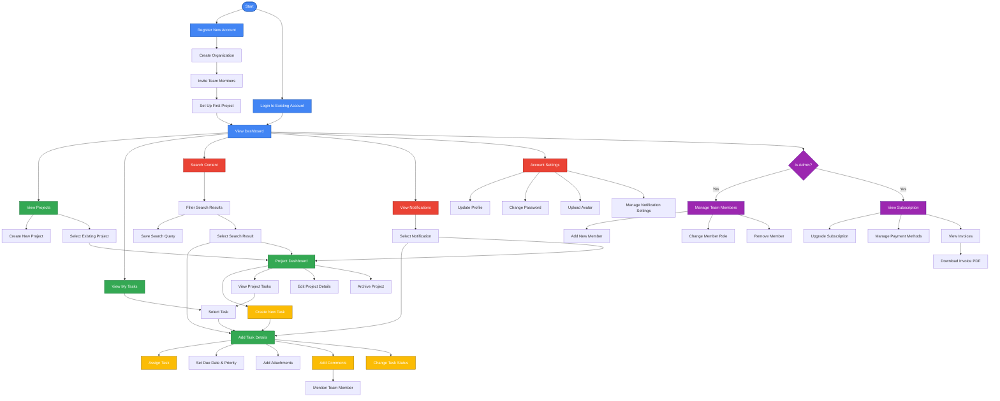

# User Journey Diagram

```mermaid
journey
    title User Journey in Task Management Application
    section Registration & Onboarding
        Create Account: 5: User
        Verify Email: 3: User
        Create Organization: 5: User
        Invite Team Members: 4: User, Admin
        Set Up First Project: 5: User, Admin
    
    section Daily Usage
        Log In: 5: User, Admin
        View Dashboard: 5: User, Admin
        Create New Task: 4: User, Admin
        Assign Task: 3: User, Admin
        Add Task Details: 4: User, Admin
        Upload Attachments: 3: User, Admin
        Set Due Date & Priority: 4: User, Admin
        Add Comments: 4: User, Admin
        Change Task Status: 5: User, Admin
        Search for Tasks: 4: User, Admin
        Filter Tasks: 3: User, Admin
        Save Search Query: 3: User, Admin
    
    section Project Management
        Create New Project: 5: Admin
        Edit Project Details: 4: Admin
        Archive Project: 3: Admin
        View Project Progress: 5: User, Admin
        Generate Project Reports: 4: Admin
    
    section Team Collaboration
        Mention Team Member: 4: User, Admin
        Receive Notifications: 5: User, Admin
        Respond to Comments: 4: User, Admin
        Share Task Link: 3: User, Admin
    
    section Account Management
        Update Profile: 3: User, Admin
        Change Password: 3: User, Admin
        Upload Avatar: 2: User, Admin
        Manage Notification Settings: 4: User, Admin
    
    section Organization Administration
        Manage Team Members: 5: Admin
        Change Member Roles: 4: Admin
        Remove Members: 3: Admin
        View Organization Usage: 4: Admin
    
    section Subscription & Billing
        View Subscription Plans: 4: Admin
        Upgrade Subscription: 3: Admin
        Add Payment Method: 3: Admin
        View Invoices: 3: Admin
        Download Invoice PDF: 2: Admin
        Update Billing Information: 3: Admin
```

# User Flow Diagram

```mermaid
flowchart TD
    %% Main entry points
    Start([Start]) --> Register[Register New Account]
    Start --> Login[Login to Existing Account]
    
    %% Registration flow
    Register --> CreateOrg[Create Organization]
    CreateOrg --> InviteMembers[Invite Team Members]
    InviteMembers --> SetupProject[Set Up First Project]
    SetupProject --> Dashboard
    
    %% Login flow
    Login --> Dashboard[View Dashboard]
    
    %% Dashboard branches
    Dashboard --> ViewProjects[View Projects]
    Dashboard --> ViewTasks[View My Tasks]
    Dashboard --> SearchContent[Search Content]
    Dashboard --> ViewNotifications[View Notifications]
    Dashboard --> AccountSettings[Account Settings]
    
    %% Projects flow
    ViewProjects --> CreateProject[Create New Project]
    ViewProjects --> SelectProject[Select Existing Project]
    SelectProject --> ProjectDashboard[Project Dashboard]
    ProjectDashboard --> CreateTask[Create New Task]
    ProjectDashboard --> ViewProjectTasks[View Project Tasks]
    ProjectDashboard --> EditProject[Edit Project Details]
    ProjectDashboard --> ArchiveProject[Archive Project]
    
    %% Tasks flow
    ViewTasks --> SelectTask[Select Task]
    ViewProjectTasks --> SelectTask
    CreateTask --> TaskDetails[Add Task Details]
    SelectTask --> TaskDetails
    TaskDetails --> AssignTask[Assign Task]
    TaskDetails --> SetDueDate[Set Due Date & Priority]
    TaskDetails --> AddAttachments[Add Attachments]
    TaskDetails --> AddComments[Add Comments]
    TaskDetails --> ChangeStatus[Change Task Status]
    AddComments --> MentionUser[Mention Team Member]
    
    %% Search flow
    SearchContent --> FilterResults[Filter Search Results]
    FilterResults --> SaveSearch[Save Search Query]
    FilterResults --> SelectSearchResult[Select Search Result]
    SelectSearchResult --> TaskDetails
    SelectSearchResult --> ProjectDashboard
    
    %% Notifications flow
    ViewNotifications --> SelectNotification[Select Notification]
    SelectNotification --> TaskDetails
    SelectNotification --> ProjectDashboard
    
    %% Account settings flow
    AccountSettings --> UpdateProfile[Update Profile]
    AccountSettings --> ChangePassword[Change Password]
    AccountSettings --> UploadAvatar[Upload Avatar]
    AccountSettings --> NotificationSettings[Manage Notification Settings]
    
    %% Admin specific flows
    Dashboard --> OrgAdmin{Is Admin?}
    OrgAdmin -->|Yes| ManageMembers[Manage Team Members]
    OrgAdmin -->|Yes| ViewSubscription[View Subscription]
    
    %% Team management flow
    ManageMembers --> AddMember[Add New Member]
    ManageMembers --> ChangeMemberRole[Change Member Role]
    ManageMembers --> RemoveMember[Remove Member]
    
    %% Subscription flow
    ViewSubscription --> UpgradeSubscription[Upgrade Subscription]
    ViewSubscription --> ManagePayment[Manage Payment Methods]
    ViewSubscription --> ViewInvoices[View Invoices]
    ViewInvoices --> DownloadInvoice[Download Invoice PDF]
    
    %% Styling
    classDef primary fill:#4285F4,stroke:#0D47A1,color:white
    classDef secondary fill:#34A853,stroke:#0D652D,color:white
    classDef tertiary fill:#FBBC05,stroke:#866102,color:white
    classDef quaternary fill:#EA4335,stroke:#980905,color:white
    classDef decision fill:#9C27B0,stroke:#4A148C,color:white
    
    class Start,Login,Register,Dashboard primary
    class ViewProjects,ViewTasks,ProjectDashboard,TaskDetails secondary
    class CreateTask,AssignTask,AddComments,ChangeStatus tertiary
    class OrgAdmin,ManageMembers,ViewSubscription decision
    class SearchContent,AccountSettings,ViewNotifications quaternary
```
